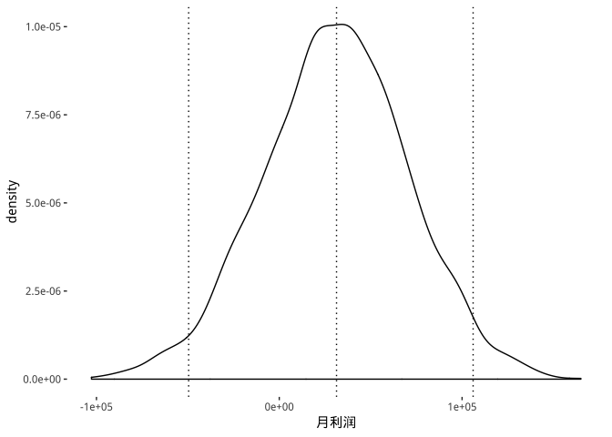
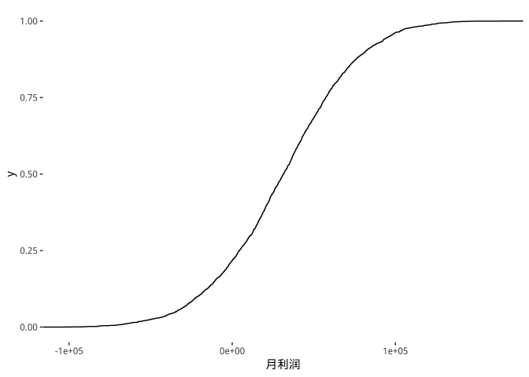
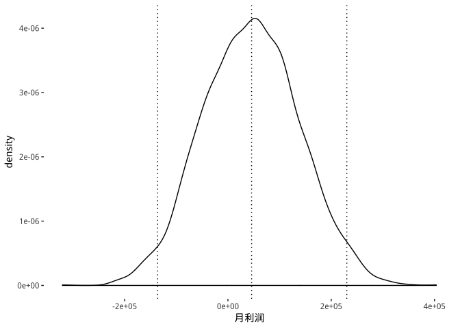
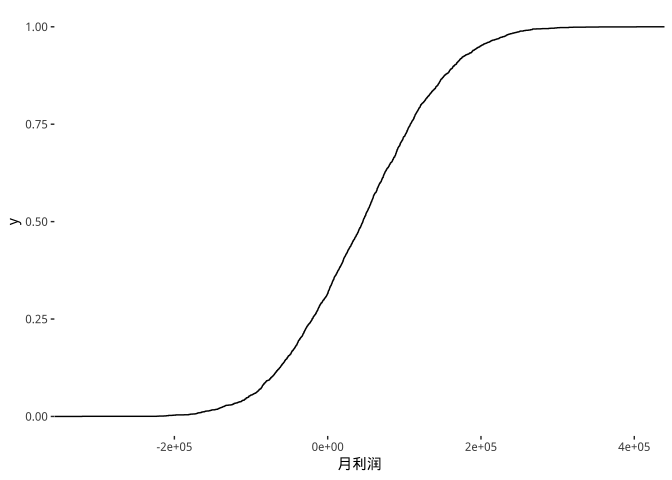
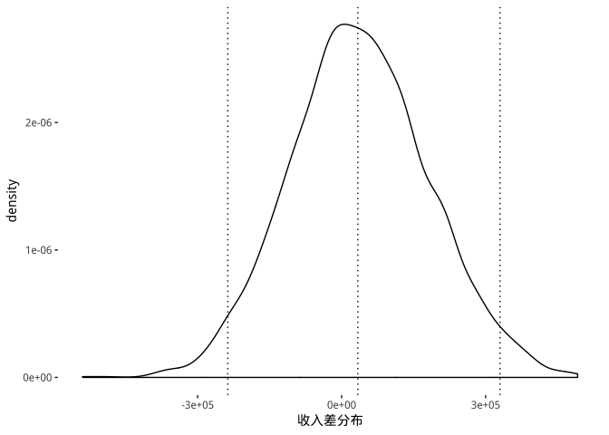
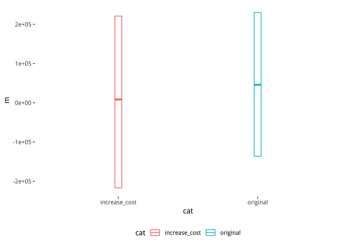

README
================
ZhangJie

Q1 利润为正态分布，95%置信区间见下
----------------------------------

    ##      2.5%     97.5% 
    ## -49570.18 106037.93

Q2 目标达成和亏损概率见下
-------------------------

    ## # A tibble: 1 x 2
    ##   goal_prob loss_prob
    ##       <dbl>     <dbl>
    ## 1     0.038     0.217

Q3 累积分布函数见下
-------------------

Q4 结果修正见下
---------------

    ##      2.5%     97.5% 
    ## -136282.6  230186.0

    ## # A tibble: 1 x 2
    ##   goal_prob loss_prob
    ##       <dbl>     <dbl>
    ## 1     0.281     0.316

Q5 应该选用原方案
-----------------

    ##      2.5%     97.5% 
    ## -216865.6  221049.6

